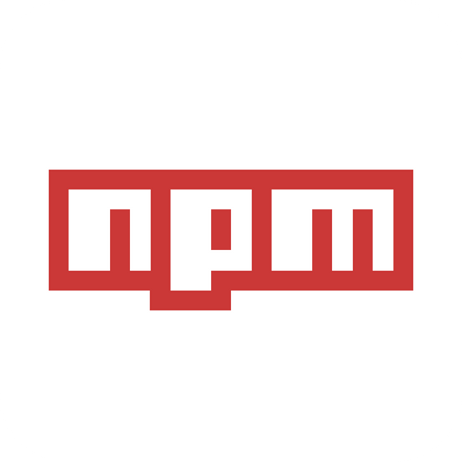

<h2> Hi, I'm Manuel! </h2>

###  A little more about me

```python
class Manuel:
def __init__(self):
 print("- 📊 My Stats:")
 self.country = "Colombia"
 self.name = "Manuel"
 self.age = "20"
 self.status = "Student"
 print("- 🔨 Languages and Tools:")
 self.code = ["Python", "Javascript", "C#"]
 self.frontend = ["HTML", "CSS", "React","TailwindCSS", "Astro", "Vite", "JSON", "Jest"]
 self.backend = ["NodeJs", "Django"]
 self.database = ["PostgreSQL", "Redis", "MySQL", "Supabase"]
 self.cloud = ["AWS"]
 self.tools = ["Git", "GitHub Actions", "Postman", "Bash", "VirtualBox"]
 print("- 💬 Ask me about:")
 self.others = ["#Cybersecurity", "#Cars", "#Football", "#Cooking", "#Instruments"]

def about(self):
 print("- 🔮 Hi, I'm Manuel! I'm a Full Stack Web Developer.")
 print("- 🗒 I'm currently learning Next.js, Svelte, Dart, GraphQL, Bun", "Deno")
 print("- 📫 How to reach me: meerazo7@hotmail.com")
```

---

###  My Skills

<p align="left">

<a href="https://www.python.org/" target="_blank" rel="noreferrer"></a>
<a href="https://www.djangoproject.com/" target="_blank" rel="noreferrer"></a>
<a href="https://developer.mozilla.org/es/docs/Web/JavaScript" target="_blank" rel="noreferrer"></a>
<a href="https://www.typescriptlang.org/" target="_blank" rel="noreferrer"></a>
<a href="https://markdown.es/sintaxis-markdown/" target="_blank" rel="noreferrer"></a>
<a href="https://es.reactjs.org/docs/getting-started.html" target="_blank" rel="noreferrer"></a>
<a href="https://docs.npmjs.com/" target="_blank" rel="noreferrer"></a>
<a href="https://git-scm.com/doc" target="_blank" rel="noreferrer"></a>
<a href="https://deno.land/" target="_blank" rel="noreferrer"></a>
<a href="https://redis.io/docs/" target="_blank" rel="noreferrer"></a>
<a href="https://astro.build/" target="_blank" rel="noreferrer"></a>
<a href="https://vitejs.dev/" target="_blank" rel="noreferrer"></a>
<a href="https://www.docker.com/" target="_blank" rel="noreferrer"></a>
<a href="https://eslint.org/" target="_blank" rel="noreferrer"></a>
<a href="https://tailwindcss.com/" target="_blank" rel="noreferrer"></a>
<a href="https://archlinux.org/download/" target="_blank" rel="noreferrer"></a>
<a href="https://es.wikipedia.org/wiki/Bash" target="_blank" rel="noreferrer"></a>
<a href="https://www.postman.com/" target="_blank" rel="noreferrer"></a>
<a href="https://jwt.io/" target="_blank" rel="noreferrer"></a>
<a href="https://github.com/" target="_blank" rel="noreferrer"></a>
<a href="https://www.postgresql.org/" target="_blank" rel="noreferrer"></a>
