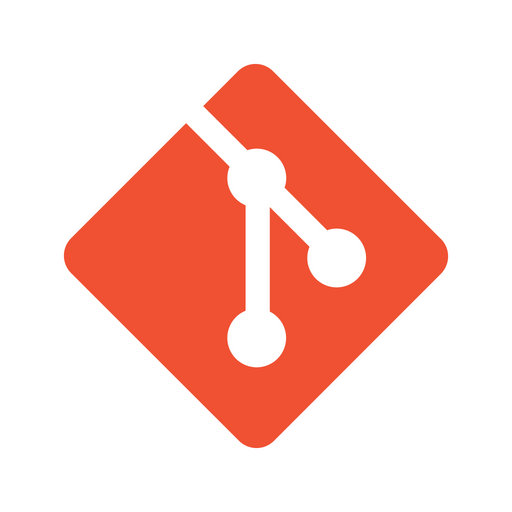
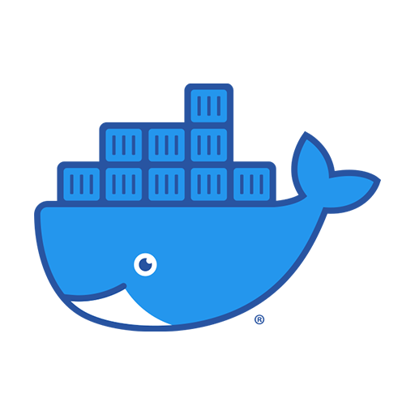

<p align="center" width="300">
   
   <h3 align="center">¡Hi, I'm Manuel! 👨🏻‍💻</h3>
</p>

<p align="center">I'm <strong> Full Stack Web Developer!</strong></p>
<p align="center">
   <a href="https://www.linkedin.com/in/manuekle/" target="blank" style='margin-right:4px'>
    
  </a>
   <a href="https://github.com/Manuekle" target="blank" style='margin-right:4px'>
    
  </a>
  <a href="https://www.instagram.com/manudev.jsx" target="blank">
    
  </a>
</p>

###  A little more about me

```python
class Manuel:
def __init__(self):
 print("- 📊 My Stats:")
 self.country = "Colombia"
 self.name = "Manuel Erazo"
 self.age = "23"
 self.status = "Freelance"
 print("- 🔨 Languages and Tools:")
 self.code = ["Python", "Javascript", "C#"]
 self.frontend = ["HTML", "CSS", "React","TailwindCSS", "Astro"]
 self.backend = ["NodeJs", "Django"]
 self.database = ["PostgreSQL", "MySQL", "Supabase"]
 self.cloud = ["AWS", "Railway", "Cloudflare"]
 self.tools = ["Git", "Postman", "Bash", "VirtualBox", "Linux", "Markdown", "Docker"]
 print("- 💬 Ask me about:")
 self.others = ["#Cybersecurity", "#Cars", "#Gym", "#Cooking", "#Instruments"]

def about(self):
 print("- 🔮 Hi, I'm Manuel! I'm a Full Stack Web Developer.")
 print("- 🗒 I'm currently learning Next.js, Svelte, Bun, Deno")
 print("- 📫 How to reach me: meerazo7@hotmail.com")
```

---

###  My Skills

<p align="left">

<a href="https://www.python.org/" target="_blank" rel="noreferrer"></a>
<a href="https://www.djangoproject.com/" target="_blank" rel="noreferrer"></a>
<a href="https://developer.mozilla.org/es/docs/Web/JavaScript" target="_blank" rel="noreferrer"></a>
<a href="https://www.typescriptlang.org/" target="_blank" rel="noreferrer"></a>
<a href="https://markdown.es/sintaxis-markdown/" target="_blank" rel="noreferrer"></a>
<a href="https://es.reactjs.org/docs/getting-started.html" target="_blank" rel="noreferrer"></a>
<a href="https://docs.npmjs.com/" target="_blank" rel="noreferrer"></a>
<a href="https://git-scm.com/doc" target="_blank" rel="noreferrer"></a>
<a href="https://deno.land/" target="_blank" rel="noreferrer"></a>
<a href="https://redis.io/docs/" target="_blank" rel="noreferrer"></a>
<a href="https://astro.build/" target="_blank" rel="noreferrer"></a>
<a href="https://vitejs.dev/" target="_blank" rel="noreferrer"></a>
<a href="https://www.docker.com/" target="_blank" rel="noreferrer"></a>
<a href="https://eslint.org/" target="_blank" rel="noreferrer"></a>
<a href="https://tailwindcss.com/" target="_blank" rel="noreferrer"></a>
<a href="https://archlinux.org/download/" target="_blank" rel="noreferrer"></a>
<a href="https://es.wikipedia.org/wiki/Bash" target="_blank" rel="noreferrer"></a>
<a href="https://www.postman.com/" target="_blank" rel="noreferrer"></a>
<a href="https://jwt.io/" target="_blank" rel="noreferrer"></a>
<a href="https://github.com/" target="_blank" rel="noreferrer"></a>
<a href="https://www.postgresql.org/" target="_blank" rel="noreferrer"></a>
